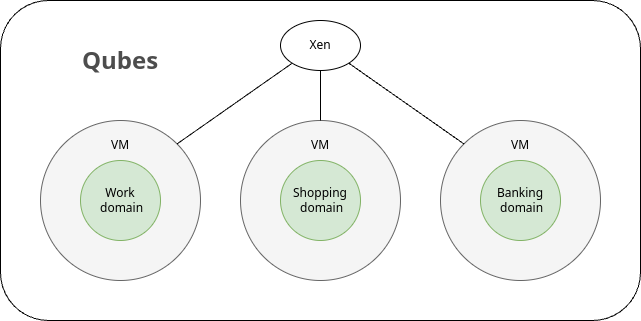
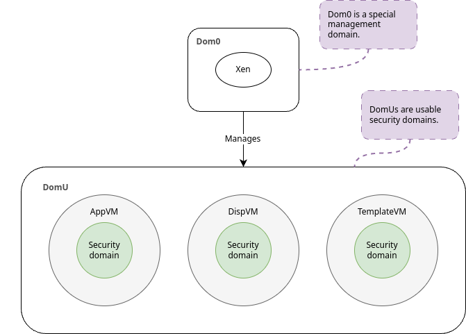
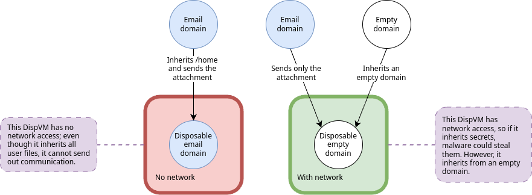
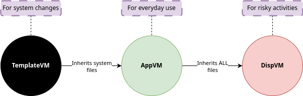
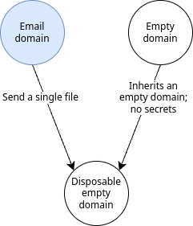
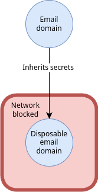

# Linux vs. Qubes: Why Linux Isn't Enough to Protect You

<figure>
  
  <figcaption><i>Photo: "Red word MALWARE (malicious software) in blue binary code of 1s and 0s on screen" by Marco Verch via ccnull.de, CC-BY 2.0</i></figcaption>
</figure>
 
 

Have you ever wondered how an attacker gains access to your system? Or if there's a better way to defend against threats? The UK government states that [half of UK businesses reported a breach or attack in 2024](https://web.archive.org/web/20250406023032/https://www.gov.uk/government/statistics/cyber-security-breaches-survey-2024/cyber-security-breaches-survey-2024). To reduce the risk of an infection, they recommend:

> - Using up-to-date malware protection.
> - Restricting admin rights.
> - Network firewalls.

These are standard, preventative measures, and while they're useful, they do not handle the most obvious case: **infection**. Malware _will_ infect your business (or computer); it's inevitable.

[Qubes](https://www.qubes-os.org/) takes an entirely different approach, and as we explore a common attack scenario, hopefully you will see how effective and useful Qubes is—enough to change your mindset from reactive to proactive.

# What is Qubes?

Qubes is an operating system—powered by [Xen](https://xenproject.org/)—that splits aspects of your online life up into **security domains**. Xen is at the heart of Qubes, and it's the primary driving force that enforces these security domains.

# What is a Security Domain?

In Qubes, a security domain is a strong boundary around aspects of your online life.

For example:

- Anonymous browsing: When you visit regular websites without identifying yourself.

- Banking: When you log into your bank, you identify as yourself.

- Work: When you use work resources, you identify as yourself.

- Misc: Sometimes you log into a chat program, forums, or websites under a pseudonym.

These are online identities, and in Qubes you can draw boundaries around each of these to keep them separate. Activities that occur in one security domain cannot affect another security domain.

In terms of Xen, these security domains are virtualization boundaries—a virtual computer within your computer (aka virtual machine, aka **VM** for short).

What does virtualization mean? Xen divides up your computer's resources into virtual spaces called virtual machines. It's possible to install operating systems into these virtual machines (VMs). You can think of them like strong containers for operating systems.

So in short, a security domain is a VM with its own operating system. Your security domains for work, shopping, banking, etc., are separate operating systems contained within a VM.

<figure>
  
  <figcaption><i>Each security domain is a VM. Xen enforces boundaries. Qubes packages them all up into a distributable operating system.</i></figcaption>
</figure>
 
 

# What Classes of Security Domains Exist?

Xen is the foundational core of Qubes. Xen communicates with the hardware and provides Qubes with a large portion of its virtualization capabilities.

Almost everything in Xen is run inside of a VM, and there are two types:

- **DomU**: Typical VMs. These are what we typically know as "security domains."

- **Dom0**: A special administration VM that manages DomUs. It is also a security domain, but it has special privileges.

Dom0 is the first thing that you see when you log into Qubes: the desktop, the menus—it's Fedora. You protect Dom0 at all costs, so it has no network access. A compromise in Dom0 is game over.

DomUs are the security domains that you will use to run your applications. Qubes splits DomUs into the following classes:

- **AppVM**: A general, everyday security domain that you run your applications in.

- **TemplateVM**: The parent of AppVMs, they provide the core system to AppVMs.

- **DispVM**: A fully disposable, temporary VM. Use these for dirty tasks that you consider risky.

A picture is worth a thousand words.

<figure>
  
  <figcaption><i>Dom0 is the domain that manages all other domains. All other domain classes are collectively known as DomUs. A DomU is the security domain that you use to draw boundaries around your identities. AppVMs, TemplateVMs, and DispVMs are classes of DomUs.</i></figcaption>
</figure>
 
 

AppVMs, TemplateVMs, and DispVMs are concepts relevant to Qubes. Dom0 and DomU are relevant to Xen. Qubes builds on top of Xen, but for the duration, only the Qubes concepts matter.

# Why are security domains important?

As mentioned earlier, security domains are virtual computers running their own operating systems; they're also boundaries around aspects of your online life.

Let me explain why security domains are important. Say that you're working on a project for work, and you open your email to talk to a client or colleague. You notice an unfamiliar email, and you open it. There's a strange message that simply says _lol_, and an attachment. You feel compelled to open the attachment to make sense of the email. You open it, and nothing. You think _that's weird_, but you move on. Weeks go by, and you think nothing of it. You wake up to a phone call one morning, and it's your bank. They say that they've blocked a suspicious transfer for \$5000 from a country on the other side of the world—but unfortunately, they did not stop two prior transfers of \$500 each.

You may not put two and two together immediately, but the email attachment that you opened earlier exploited a bug in your email reader and installed malware to steal your secrets. The attacker then further compromised your password manager, which also stores your card details. They swiped it—along with 20 of your other passwords—and sold your card details on the black market for pennies. Now you're in a situation where you need to change 20 passwords, spend hours on the phone to the bank, get new cards, and hope that you've covered all of your bases.

A keylogger, Trojan horse, or remote exploit—these are very real scenarios. Software has bugs—some benign, some dangerous. It's thought that [for every one thousand lines of code, there is at _least_ one exploitable bug](https://stackoverflow.com/a/56043694). I don't know if you've ever counted how many lines of code are in your operating system, but let me save you some time: it's tens of millions—that's at _least_ tens of thousands of exploitable bugs. You only need to look at the [long list of reported CVEs](https://www.cve.org/CVERecord/SearchResults?query=Linux)—Common Vulnerabilities and Exposures—to realize that it's a revolving door.

Software is no joke: it flies airplanes, runs ICU wards, handles trillions of dollars in bank transfers, and, of course, it runs your web browser that displays your cat videos. But you also work at a hospital, a bank, or a research lab at a prestigious university. A foot in the door is all that an attacker needs to kick off a high-profile ransomware attack like [WannaCry](https://en.wikipedia.org/wiki/WannaCry_ransomware_attack).

So you see, protecting your own system is as much about protecting your own bank account as it is about protecting the organization that trusts you with its secrets and credentials. This is why it's so important to consider something like Qubes if you are in a position of responsibility, and most of us are.

# Linux Isn't An Open Door: It Provides Some Protection

Attackers cannot waltz into your Linux machine and plant whatever and whenever they want. An attacker needs to work hard to find an exploit and deliver it, and then they need to build upon that attack. Linux does have some security features to prevent attacks.

- **DAC** (Discretionary Access Control): Essentially file permissions and passwords—when you provide a password to install software, that is DAC.

- **MAC** (Mandatory Access Control): Like locked doors and access codes, software can only access exactly what it's allowed to. Typically the developer, or your Linux distro vendor, writes these policies.

- **Kernel Self-Protection**: A suite of policies and sensible defaults that hardens how the Linux kernel mediates access to resources—in a nutshell, it tries to avoid doing stupid things.

- **PIE/PIC** (Position Independent Executables and Position Independent Code): A fancy way of saying that executables frequently change their address (in memory) to avoid the bad guys.

There are a lot of other aspects about the Linux system that contribute to its security, but they're out of scope. The point that I wish to make is that Linux does some things to protect your system, but it operates on one simple principle: **prevention**. If the system is compromised, the game is over.

# Qubes Does Security Differently: Disposable Containers

Security domains get all of the protections provided by Linux, but Qubes doesn't try to protect your system from compromise. Instead, Qubes provides you with the mechanisms to dispose of an infected security domain and start again—in minutes.

# How Does Qubes Enforce a Security Domain?

A recap: Security domains—VMs—are boundaries around your online identities. Each security domain has different qualities, but the AppVM is what you will typically use.

If we look back at the email compromise story from earlier and imagine that instead of using bare Linux, you had used Qubes instead and that you had two security domains: email and banking.

Now you open your email client and see the suspicious email. You download the attachment, but instead of opening it, you open it the Qubes way: you right-click it and choose "open in a disposable VM."

Qubes spins up another VM (security domain). This new, isolated security domain receives the attachment and opens it; it installs malware. This time it's different: The attack occurs in an empty disposable VM.

The malware tries to locate your passwords, browser sessions, ANYTHING—it finds nothing. The malware then tries to call home, but has no network access—you configured it that way. The attack fails; nothing happens, and the disposable VM powers down, wiping all of its changes—including an installed keylogger. Your system is as clean as a whistle.

<figure>
  
  <figcaption><i>DispVMs can inherit from any AppVM. If a DispVM inherits from an AppVM with secrets, those secrets are available to everything inside of the DispVM—including malware. You can either block network access or inherit from an empty domain.</i></figcaption>
</figure>
 
 

This is—in the Qubes world—a disposable VM. As the name suggests, they're temporary and only last for as long as they're powered up.

# How Do Security Domain Classes Relate?

Disposable VMs are the nuclear option—you use them for risky activities or to ensure an entirely clean slate.

There are two other classes mentioned earlier; we need to understand the relationship between them.

<figure>
  
  <figcaption><i>The TemplateVM provides system files. The AppVM provides user files. The DispVM receives both.</i></figcaption>
</figure>
 
 

- Changes made to the TemplateVM are reflected in all of the others.

- Changes made to the AppVM reflect in the DispVM.

- Changes made to a DispVM go into the void.

We protect and install software into the TemplateVM. We use AppVMs for everyday usage. We can base our DispVM off any AppVM—with some caveats.

# How Do Security Domain Classes Differ?

Essentially they differ in how they save changes to disk.

First, you probably know that `/` is the root directory; that `/home/*` is where your personal and user configuration files live. You can change files in your home directory because you have the correct permissions.

Directories like `/`, `/etc`, `/lib`, `/boot` or `/bin` contain important software and configurations—poisoning any of these can alter how the system operates. It's important for Linux to protect privileged directories with root permissions. Qubes protects privileged directories with a unique approach.

Qubes attaches to each security domain multiple logical volumes—one for each of `/`, `/home`, etc. Qubes treats user files and system files differently. When a security domain restarts, Qubes resets `/` back to a clean state—a snapshot, and in some cases, `/home` too.

This table shows which logical volumes each security domain class resets:

|       Type |   `/`    | `/home`  | Note                                                    |
| ---------: | :------: | :------: | :------------------------------------------------------ |
|      AppVM | &#x2705; | &#x274C; | For general purpose usage. It preserves personal files. |
|     DispVM | &#x2705; | &#x2705; | For risky tasks. It preserves nothing.                  |
| TemplateVM | &#x274C; | &#x274C; | To administer the others, e.g., software installs.      |

AppVMs preserve user files; DispVMs go full nuclear.

This table shows that when you reboot an AppVM, it preserves all of your user files—e.g., your browser bookmarks, cookies, etc. AppVMs are usable for everyday use, but they still protect the root file system. The other domains are for specific purposes.

The TemplateVM doesn't reset any logical volumes, because it's where we make system-level changes to our security domains. See the relationships diagram above.

# How Should You Use an AppVM?

An AppVM is an everyday security container. You make almost all of your security domains out of these. You can create AppVms for

- Daily browsing

- Untrusted activities

- Work

- Development

- Banking

- Shopping

- Email

Segregating your online life ensures that if malware compromises your "daily" browsing domain, it cannot affect any other domain.

AppVMs persist the state in `/home`, so adding bookmarks to your browser, installing GIMP plugins, changing your shell configuration file, or any `/home` related activities all persist after reboot. However, it always resets system-level changes (/) because these are usually the target areas for malware.

# How Should You Use a DispVM?

A DispVM has read-only access to the AppVM that it's based upon. If that AppVM has secrets, then perhaps you shouldn't base a DispVM upon it.

You can use any AppVM as a template. I typically create a blank AppVM, put nothing in it, and use that. It's empty, and it contains no secrets. When I perform a risky activity in such a DispVM—e.g., launch a PDF—any malicious outcome cannot steal secrets.

<figure>
  
  <figcaption><i>When a DispVM inherits from an empty domain, there are no secrets to steal. You can then send and open a file inside of that DispVM. If there is malware in the sent file, it has no access to secrets.</i></figcaption>
</figure>
 
 

You can also restrict or remove network access to any security domain—including DispVMs. When you restrict network access, you limit how effective the malware is—if it cannot report home, it's useless.

<figure>
  
  <figcaption><i>When you open something in a network-restricted DispVM, malware cannot phone home.</i></figcaption>
</figure>
 
 

# How Should You Use a TemplateVM?

You use this for one purpose: to make system changes to your security domains.

A TemplateVM provides the `/` portion of your AppVM and DispVM, which means that you need to install software into the TemplateVM. For example, if you need to change `/etc` then you need to change it in the TemplateVM.

TemplateVMs do not allow you to do anything except install software and configure changes—they block regular web browsing.

# Recap: How Does it All Fit Together?

So we've looked at

- AppVMs: A general-purpose security domain that protects `/` with snapshots, but not `/home`.

- DispVMs: A temporary security domain that protects the entire file system with snapshots—it may be blank, inherit user files, or have no network access.

- TemplateVMs: An administration domain that configures AppVMs and DispVMs.

So that's the theory, but what does that look like in practice? I can speak of my personal setup and what I use them for:

- Daily: My everyday browser: YouTube, Y Combinator, Reddit, and LOLcats.

- Dev: A programming domain that contains my code, editors, compilers, tools, Docker, and lots of tears.

- Notes: A research domain that contains Emacs and a web browser.

- Sec: A DispVM that I use for shopping, banking, and email.

I have a lot more domains than this, but this is enough to illustrate the point.

I use the browser in my 'dev' domain to log into GitHub and a few other services. This security domain is where I write my code, so it's important to protect it.

Every time I boot up the "sec" (secure) domain, it starts a brand new temporary domain. I can start up several. I may start two, for example, one for my email and one for shopping.

If malware attacks my "daily" browsing session, my other domains remain untouched.

- My banking domain is secure.

- My email domain is secure.

- My dev machine is secure.

What we have here is the segmentation of my online life into security domains—each security domain is protected by strong boundaries, enforced by the Xen hypervisor. Changes to the root file system in any of these security domains do not survive reboots, and all changes to disposable VMs revert—e.g., malicious changes: gone.

You may notice that I use my DispVMs slightly differently here than illustrated earlier in the article. In earlier examples I sent a DispVM a malicious file to open; here I use them as functional domains—both common approaches. In my DispVMs, I open web browsers and log into my important services; when I reboot, it's entirely reset—password, cookies, and any other changes.

# Protections From Malicious USB and Network Devices

Qubes goes the extra mile; it creates security boundaries around your USB and network ports. You may not know it, but both represent a significant risk. Both have **DMA** (Direct Memory Access). This means that the devices can write directly to system memory without the CPU.

[Wikipedia defines DMA](https://en.wikipedia.org/wiki/DMA_attack) as the following:

> Direct hardware access to read or write directly to main memory without any operating system supervision or interaction.

_Without any operating system supervision_—meaning that the operating system security measures do not apply. A USB device with its firmware rewritten can make changes to any part of system memory—even where the core operating system resides.

How common is firmware corruption, though? It depends on the device. Some are locked, some are not. The general rule of thumb in Qubes is that they are all corrupt. This makes USB devices an avenue—aka vector—for the transfer of malware.

In some cases, a USB device may not get full memory access to corrupt a system, but it can also present itself as something else and execute malicious commands. For example, the [Bad USB](https://en.wikipedia.org/wiki/BadUSB) is such an attack: a corrupt USB device presents itself as a keyboard to the operating system, and it then proceeds to type malicious commands.

What about your Wi-Fi? The same principle applies because they use the same technology. If your WiFi firmware has an exploitable bug (and it probably has a few), could a malicious neighbor trick it into modifying your system memory? Your neighbors are probably decent people, but what about people at a random coffee shop or a hotel? What if you're responsible for trade secrets or important research data—does a targeted attack sound so unlikely then?

These risks are why Qubes draws boundaries around USB and network devices. In fact, they're special boundaries: Qubes uses a technology called **VT-d**, which means that it can assign a separate memory segment to each device. If the device goes rogue, it can only modify its own memory segment.

So in short, USB and network devices are attack vectors because they have direct memory access. Qubes isolates them at the hardware level and wraps them in their own security boundaries—called `sys-usb` and `sys-net`.

# Conclusion

Linux is great. I use it every day in my security domains—Dom0 and all of my DomUs (application domains). However, Linux by itself terrifies me. How can I be sure that after years of browsing, I have not picked something up?

Qubes gives me peace of mind. With some forethought, I can put riskier activities into one domain and important activities into another. I can be nearly 100% certain that my TemplateVM is clean. As a consequence, I can be sure that my AppVMs are also clean. I can log into my bank with a DispVM knowing that as soon as I close the browser, it automatically destroys my browser session. If I open a PDF in a DispVM, it destroys any malicious changes when I close it.

In short, I use both Linux and Qubes, but Linux is incomplete without Qubes.

If you understand just how common and invisible malware is, you would be wise to take steps to protect yourself. If you're smart, you would understand that the standard approach has never worked: more walls, more bars. The only way to tackle such a problem is a fundamental shift in approach. Qubes—I think—is the first generation of operating systems to do just that.
