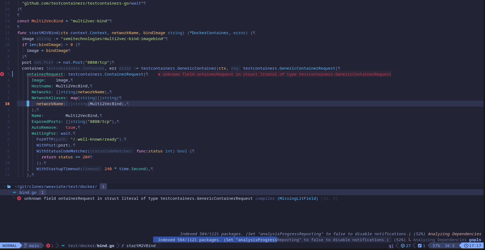

# Why Are You Scared of Neovim? It's Easy; You're Being a Big Baby

There are few pieces of software in this world that change the way that you think. Linux is one; moving away from the proprietary world of Microsoft probably has you thinking about FREE as in FREEDOM and as in FREE BEER.

[Neovim](https://neovim.io/) is another game-changer that will change how you think and interface with software. Let's explore the basics together and find out why Neovim is suitable for those who aspire to take their Linux skills to the next level.

## Neovim Unpacked: What Is It, and Should You Care?

Consistently voted one of the most desirable text editors on Stack Overflow, year in and year out, Neovim's aims are simple: keyboard-driven input and efficiency.

Its learning curve is steeper than a plain old text editor, but not as steep as you may think. Most of Vim's and Neovim's keymaps are mnemonic, which means that the keymaps intuitively match the first letter of command names. For example, "delete inside brackets" is `di(`; "delete word" is `dw`.

Three things that set Neovim apart from Vim:

- Lua: Neovim uses Lua instead of VimScript; both languages extend their capabilities, but Lua focuses on performance.

- LSP (Language Server Protocol): Essentially built-in code intelligence for programmers.

- Tree-sitter: Better color highlighting for files: code, configuration, markdown files, etc.

<figure>
  
  <figcaption><i>LSP provides the red error message, and its companion—Trouble—displays the errors at the bottom of the screen. Tree-sitter colors individual words.</i></figcaption>
</figure>
 
 

So you see, Neovim is for beginners and advanced users alike—but it's only for beginners who wish to improve over time and eventually learn Lua. Vim and Neovim are for those who want to put in the effort to improve their workflow.

Putting it all together: Neovim's focus is on quick and efficient, keyboard-driven movements—called motions—and text manipulation—called text objects, with a strong emphasis on plugins and code.

This doesn't mean that Neovim is for programmers only, it's Vim with greater support for plugins.

## Text Wizardry 101: Motions, Objects, and Black Magic

"I don't want to waste my life learning the keymaps." This is often the excuse that I hear, but only if the rest of your life is a few hours, is this true.

What people generally don't understand is that Vim maps keys mnemonically (easy-to-remember). I never learned all of the keymaps; I learned about a dozen keymap elements.

**Motions** (i.e., **movements**) are simple:

- left, down, up, right: `h`, `j`, `k`, `l`

- Jump to the beginning of the next word: `w`

- Jump to the beginning of a sentence: `^`

- Jump to the end of a sentence: `$`

There are 15-20 common movement keys that you will learn.

**Text objects** (i.e., **text manipulation**) use easy-to-remember keymaps:

- Delete around a word: `daw`

- Delete to the end of the line: `d$`

- Delete the entire line: `dd`

- Delete inside of brackets: `di(`

- Delete around brackets: `da(`

There are hundreds—if not thousands—of combinations, all simple to remember because the keystrokes (elements) often resemble common English words.

After a day or two you will have fully committed to memory 10-15 core motions and text objects, enough to perform basic text editing.

## The Neovim Cult—Err, Community

Vim and Neovim have absolutely gigantic communities—probably millions of users, and one thing above all else should determine your choice in tooling: support. Support comes in two forms: help and development.

Neovim has active communities in the area of help:

- Forums: They have an active Discord forum.

- Chat: There is an active Matrix channel where many of the core and plugin developers hang out.

- Support tickets: Address software problems on their GitHub issue tracker;

- Discussions: Discuss the future development direction, or get general authoritative help on their GitHub discussions page.

Plugins also maintain their own small communities, often on Matrix or GitHub.

## Pluginsanity: How Neovim’s Ecosystem Makes It Unbeatable

Neovim has thousands of plugins and around 100 plugins that almost everybody uses. Format documents, check your work, or interact with your project in useful ways.

Some of the most popular plugins:

- [fzf-lua](https://github.com/ibhagwan/fzf-lua): A fuzzy search interface where you type a close approximation for your query, and it interactively finds the closest match in real-time.

- [telescope.nvim](https://github.com/nvim-telescope/telescope.nvim): Similar to fzf-lua.

- [todo-comments.nvim](https://github.com/folke/todo-comments.nvim): Annotate comment lines with words like TODO, FIXME, etc., and search through them via Telescope or fzf-lua.

- [mason.nvim](https://dotfyle.com/plugins/williamboman/mason.nvim): for those who write code, this is essentially a package manager for LSP (language intelligence), linters (code checkers), formatters (automatic styling), and debuggers.

<figure>
  
  <figcaption><i><b>fzf-lua</b>: As you type, the list of files updates in real time, and it displays the contents of the selected file.</i></figcaption>
</figure>
 
 

<figure>
  
  <figcaption><i><b>mason.nvim</b>: A list of installed applications. You can use this menu to install from thousands of options.</i></figcaption>
</figure>
 
 

Neovim's extensibility and the size of its community ensure that there are continuously new plugins and new ideas. You can find a lot more plugins and keep up to date with new plugins on [dotfyle](https://dotfyle.com/).

## The Beginner's On-Ramp: How Distros Make the Leap Less Scary

Popular, extensible applications in Linux often end up with distributions—e.g., what Debian is to Linux, LazyVim is to Neovim. Every distribution has their own approach, plugins, and defaults.

Some notable distributions are [AstroNvim](https://astronvim.com/), [NvChad](https://github.com/NvChad/NvChad), and [LazyVim](http://www.lazyvim.org/). I personally use LazyVim because it's for people who want to spend less time configuring their text editor.

<figure>
  
  <figcaption><i><b>NvChad</b>: Copyright © 2025 Siduck™. (Fair use.)</i></figcaption>
</figure>
 
 

<figure>
  
  <figcaption><i><b>AstroNvim</b>: © The AstroNvim Team. (Fair use.)</i></figcaption>
</figure>
 
 

Configuring complex applications takes work and maintenance. Over time things change and break. But using a distribution like LazyVim means that you get the benefits of someone else developing your configuration, yet you still have the power to override any of the defaults. You can still configure it exactly as you want.

The drawback with distributions is the "abstractions"—aka "magic": it hides the detail and does a lot of work out of view. When something breaks, it's not as easy to understand. When you want to change something, you need to understand a little bit about that "magic"—read the documentation. Distributions are easy to get started, but they do take some effort eventually. That said, they're still a net gain.

## Closing Thoughts: Why Neovim Deserves a Chance

This isn't a guide on how to get started in Neovim; it's an attempt to convince you why you should be using it.

The community is large, and the support material is plenty. Maintenance and new features are continuous, and new plugins pop up all of the time.

The biggest win for Vim and Neovim is the efficiency to do exactly as you want with little effort. Once you commit that to muscle memory, you will be modifying text as efficiently as you press the keys on your keyboard. Using Vim is a change of mindset more than it is a change of an editor. You feel closer to the task at hand and more immersed in the flow of ideas than the execution of them.

To add to that, Neovim is endlessly extensible, and if you pick up Lua, it's extensible exactly as you need.
